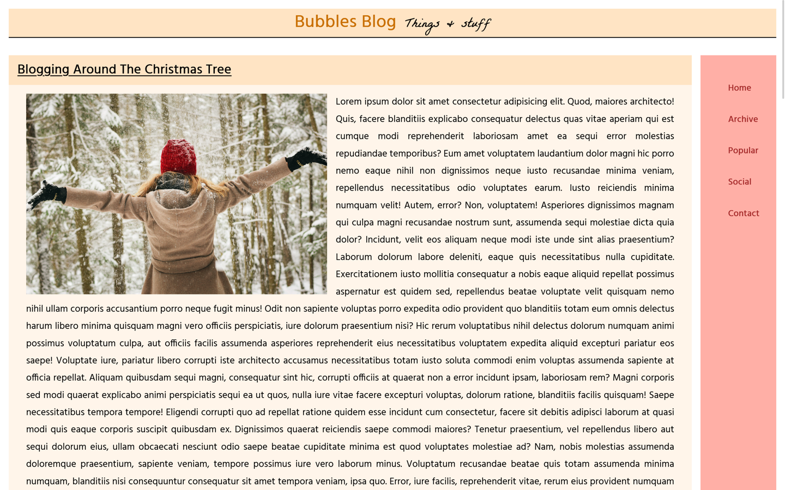
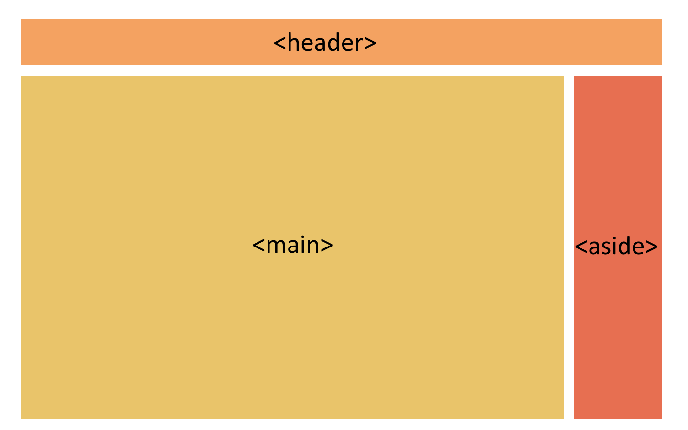
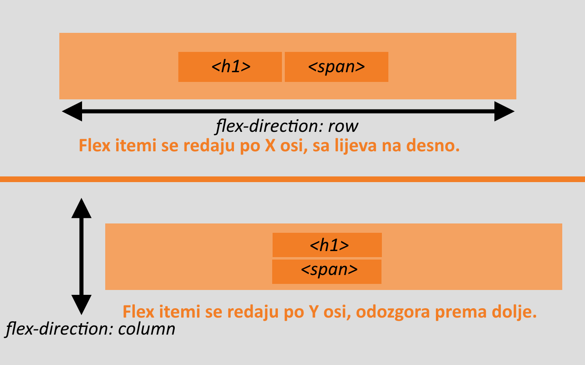

# Uvod

Pozdrav svima i dobro došli u današnji CSS zadatak. Današnji cilj je napraviti blog koji izgleda ovako koristeći samo HTML i CSS. HTML datoteku kao i ostale resurse možete preuzeti na Github repozitoriju.



# Priprema

## Pregled HTML-a

Za početak ćemo pregedati naš HTML dokument. Primjećujemo da unutar `<body>` taga imamo tri elementa; `<header>`, `<main>` i <`aside`>, unutar kojih se nalazi sav sadržaj naše web stranice.

`<header>` se sastoji od naslova `<h1>` i `<span>` elementa.

Unutar `<main>` elementa imamo tri jednaka `<article>` elementa koji sadrže naslov, sliku i paragraf.

U `<aside>` elementu se nalazi navigacijski izbornik posložen u jednostavnu listu.

- ## `<header>`
  - `<h1>`
  - `<span>`
- ## `<main>`
  - ### `<article>`
    - `<h2>`
    - ``
    - `<p>`
- ## `<aside>`
  - ### `<nav>`
    - **`<ul>`**
      - `<li>`

## Pregled web stranice

Pogledajmo sada našu željenu web stranicu.

Primjećujemo da su naša tri glavna elementa posložena na način da se `<header>` proteže cijelom širinom te se naravno nalazi na samom vrhu stranice.

`<main>` i `<aside>` dijele preostali prostor, s tim da `<main>` zauzima veliku većinu širine. Oba elementa se protežu čitavom visinom stranice.



# Izrada web-stranice

## Priprema

### Eksterni CSS

Za početak ćemo unutar istog direktorija gdje se nalazi naš HTML dokument stvoriti i novi CSS dokument kako bismo mogli koristiti vanjski CSS. Ja ću svoj novi dokument nazvati `style.css` te ga odmah povezati na HTML koristeći `<link>` tag.

### Dodavanje Google fontova

Na našem blogu ćemo za gotovo sav sadržaj koristiti font **Hind**. Samo ćemo za podnaslov u našem headeru koristiti font **La Belle Aurore**. Oba fonta se nalaze na Google Fonts, odakle ćemo ih direktno dodati u naš HTML dokument kako bismo ih mogli koristiti:

- [Hind](https://fonts.google.com/specimen/La+Belle+Aurore)
- [La Belle Aurore](https://fonts.google.com/specimen/La+Belle+Aurore)

### CSS Reset

Prije nego što počnemo raditi na izgledu naše web-stranice, napraviti ćemo brzinski CSS reset kako bismo si olakšali daljnji posao. Poništiti ćemo sve predodređene margine i paddinge, te ćemo promjeniti `box-sizing` svojstvo u `border-box`.

> `box-sizing: border-box` će u širine i visine naših elemenata uračunati i njihove paddinge i margine, što nam uvelike olakšava posao.

```
* {
  box-sizing: border-box;
  padding: 0;
  margin: 0;
  }
```

Također želimo izbjeći problem **side-scrollanja** zbog slika velikih dimenzija, pa ćemo im maksimalnu širinu postaviti na 100%:

```
img {
  max-width: 100%;
}
```

## Layout

Napokon možemo početi sa postavljanjem layouta naše web-stranice. Kao što smo vidjeli ranije, najvišlji element naše web-stranice jest `<header>`, pa ćemo početi sa uređivanjem istoga.

### Header layout

Primjetimo da naš `<header>` u sebi sadrži samo dva elementa, `<h1>` i `<span>`, koje je potrebno centrirati te postaviti jedan pored drugoga. To ćemo lako odraditi koristeći CSS flexbox.

#### **Flex containers i items**

Dodavajući `header` selektoru `display: flex` svojstvo, on postaje **_flex container_**, a njegova direktna djeca postaju **_flex itemi_**. Dakle, u ovom slučaju naš `header` je postao flex container, dok su `h1` i `span` elementi unutar njega postali flex itemi. Zbog toga smo sada u mogućnosti nad njima upotrebljavati sva svojstva koja nam donosi flex.

```
header {
  display:flex
}
```

#### **Flex direction - X i Y os**

Jedno od osnovnih flex svojstava jest `flex-direction` koji određuje **_glavnu os_** kojom se naš flex container proteže. U našem slučaju nam je potrebno da se flex container proteže po X osi, odnosno sa lijeva na desno, jer će tako biti poredani naši flex itemi. Obzirom da je ovo predoređeno svojstvo, u našem slučaju ne moramo ništa dodavati, jer je postavljanjem `display:flex` svojstva, naš element postao flex container koji se proteže po X osi. No, ukoliko želimo, slobodno bismo ovdje mogli upisat i `flex-direction: row`.

```
header {
  display:flex
  flex-direction: row /* već postavljeno po defaultu */
}
```



#### **Postavljanje elemenata po glavnoj osi**

Za postavljanje elemenata po glavnoj osi flex containera koristimo svojstvo `justify-content`. U našem slučaju mi ćemo primjeniti `justify-content: center` kako bi smo naš `h1` i `span` centrirali jedan pored drugoga, u samoj sredini `header` elementa.

```
header {
  display:flex
  flex-direction: row
  justify-content: center
}
```

#### **Postavljanje elemenata po poprečnoj osi**

Flex elemente također možemo postavljati obzirom na njihovu poprečnu os, koristeći svojstvo `align-items`.

> Ako je `flex-direction: row`, X nam je glavna os, a Y poprečna.

> Ako je `flex-direction: column`, situacija je obratna; Y nam je glavn os, a Y poprečna.

U našem slučaju želimo da naša dva elementa budu postavljeni na sami kraj poprečne osi, odnosno na dno header elementa, pa ćemo iskoristiti `align-items: flex-end`.

```
header {
  display:flex
  flex-direction: row
  justify-content: center
  align-items: flex-end
}
```

#### **Razmicanje flex elemenata**

Flex svojstva `row-gap` i `column-gap` vrlo su zgodni za razdvajanje flex itema unutar jednog containera. Obzirom da su naši elementi posloženi po X osi, mi ćemo koristiti `column-gap` kako bismo stvorili razmak između njih. Vrijednost ćemo postaviti na `1rem`.

```
header {
  display:flex
  flex-direction: row
  justify-content: center
  align-items: flex-end
  column-gap: 1rem
}
```

Time smo dobili željeni layout našeg `header` elementa. Dakle, proteže nam se cijelom širinom stranice, a elementi unutar njega su centrirani, imaju isto "dno" te imamo potrebni razmak između njih. Kasnije ćemo se još malo vratiti na `header` kako bismo uredili njegov izgled, ali za sada smo ostvarili naš cilj - postavljanje layouta.

## Body layout

Kao što smo ranije spomenuli, ostatak web-stranice zauzimaju tagovi `<main>` i `<aside>`, te ćemo sada njih posložiti kako treba, također koristeći flex. Slično kao i kod `<header>` elementa, ovdje imamo elemente koje treba posložiti po X osi (`<main>` i `<aside>` se nalaze jedan pored drugog, a ne jedan iznad drugog).

To bi značilo da moramo `<main>` i `<aside>` pretvoriti u flex iteme kako bismo ih mogli posložiti unutar njihovog flex containera. No, što bi ustvari bio njihov flex container? Njihov direktan roditelj je `<body>`, no njega ne možemo upotrijebiti jer bi se onda i `<header>` posložio zajedno sa njima, a to ne želimo jer nam `<header>` mora ostati iznad svoje braće `<main>` i `<aside>`.

### Flex container (wrapper)

Vrlo jednostavan i često korišten način za rješavanje ovog problema je kreiranje novog roditelj elementa kojeg ćemo postaviti kao flex container. Pa ćemo tako u našem HTML-u napraviti novi `<div>` koji će obuhvaćati `<main>` i `<aside>`, skupa sa njihovom djecom, te mu dati `class="flex-container"`.

```
 <div class="flex-container">
      <main>
        <article>
              ....
        </article>
      </main>
      <aside>
        <nav>
          <ul>
            ...
          </ul>
        </nav>
      </aside>
    </div>
```

Sada se možemo vratiti u naš CSS dokument, te na selektor `.flex-container` primjeniti `display:flex`. Ovime ga pretvaramo u flex container, a njegovu direktnu djecu (`main` i `aside`) u flex iteme, koji će se već po defaultu posložiti po X osi, baš kako i želimo!

```
.flex-container {
   display:flex;
}
```

Ponovno smo na vrlo jednostavan način dobili željeni rezultat - slaganje elemenata jedan pored drugoga bez da moramo petljati sa marginama, širinama elemenata i slično. Uskoro ćemo naše elemente urediti da izgledaju kako bi trebali, ali prije toga samo još jedna stvar.

### Floats

Vidjeli smo na početku da u finalnoj verziji stranice slike ne zauzimaju cijelu širinu članka, nego samo otprilike polovicu, a tekst se "omotava" oko nje tako da joj je i sa desne strane, ali i ispod nje. To radimo pomoću svojstva `float`.

```
img:

Trenutno su nam sve slike na našoj stranici prevelike, te ih je potrebno smanjiti kako bi stranica izgledala urendije. Znamo da nam je najjednostavniji način za to korištenje svojstva `width`:

```

img {
width: 600px;
}

```

No, ovo nije idealno rješenje iz razloga što smo koristili `px`, koji je fiksna jedinica, te nam može stvoriti problem. Primjerice, što ako netko otvori našu stranicu sa mobilnog uređaja koji ima širinu ekrana `480px`? Naša slika će se protezati većom širinom, te nam se ponovno pojavljuje problem horizontalnog scrollanja.

Mi smo ovaj problem riješili još na početku kada smo kreirali naša **CSS reset** svojstva, te tamo postavili maksimalnu širinu slika na 100%, pa će u ovom primjeru slika smanjiti svoje dimenzije kako bi stala na bilo koji ekran.

```
