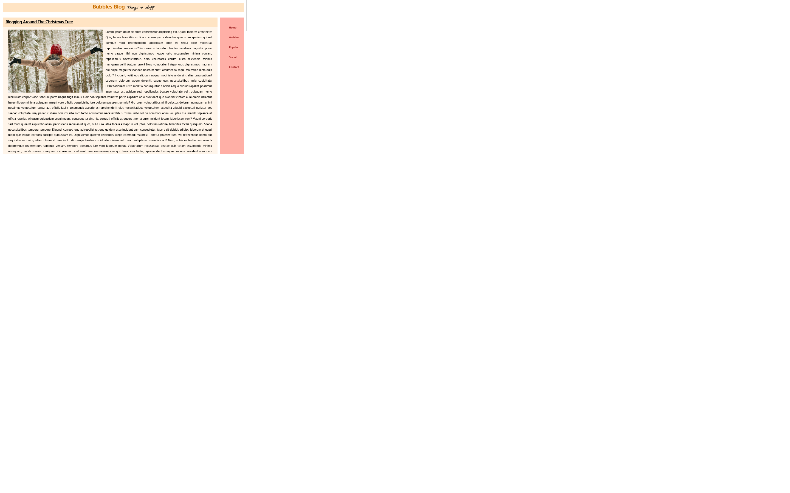

# Uvod

Pozdrav svima i dobro došli u današnji CSS zadatak. Današnji cilj je napraviti blog koji izgleda ovako koristeći samo HTML i CSS. HTML datoteku kao i ostale resurse možete preuzeti na Github repozitoriju.

## Pregled HTML-a

Za početak ćemo pregedati naš HTML dokument. Primjećujemo da unutar `<body>` taga imamo tri elementa; `<header>`, `<main>` i <`aside`>, unutar kojih se nalazi sav sadržaj naše web stranice.

`<header>` se sastoji od naslova `<h1>` i `` elementa.

Unutar `<main>` elementa imamo tri jednaka `<article>` elementa koji sadrže naslov, sliku i paragraf.

U `<aside>` elementu se nalazi navigacijski izbornik posložen u jednostavnu listu.

- ## `<header>`
  - `<h1>`
  - ``
- ## `<main>`
  - ### `<article>`
    - `<h2>`
    - ``
    - `
`
- ## `<aside>`
  - ### `<nav>`
    - **`<ul>`**
      - `<li>`

## Pregled web stranice

Pogledajmo sada našu željenu web stranicu.

Primjećujemo da su naša tri glavna elementa posložena na način da se `<header>` proteže cijelom širinom te se naravno nalazi na samom vrhu stranice.

`<main>` i `<aside>` dijele preostali prostor, s tim da `<main>` zauzima veliku većinu širine. Oba elementa se protežu čitavom visinom stranice.
